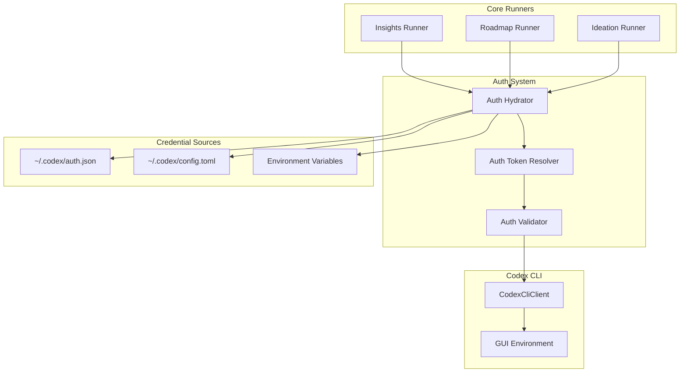

# Design Document: Third-Party Auth Stability

## Overview

本设计文档描述如何彻底解决第三方激活渠道（如 yunyi）登录的 Codex CLI 认证问题。核心目标是确保三个核心功能（洞察 Insights、路线图 Roadmap、创意 Ideation）在任何环境下都能稳定运行，包括：

1. GUI 应用从 Finder 启动时（不继承 shell 环境变量）
2. 重新安装或更新后
3. 不同的认证配置场景

## Architecture



## Components and Interfaces

### 1. Auth Hydrator (`_hydrate_env_from_codex_auth_json`)

现有实现已经包含此功能，但需要确保在所有 runner 启动时被调用。

```python
def _hydrate_env_from_codex_auth_json() -> None:
    """
    Populate process env from Codex CLI config when GUI apps don't inherit shell env.
    
    Priority:
    1. Never override explicit env vars
    2. Load from CODEX_CONFIG_DIR/auth.json if set
    3. Fall back to ~/.codex/auth.json
    
    Supported keys in auth.json:
    - OPENAI_API_KEY, api_key, apiKey, key, token -> OPENAI_API_KEY
    - api_base_url -> OPENAI_BASE_URL, OPENAI_API_BASE
    """
```

### 2. Auth Token Resolver (`get_auth_token`)

```python
def get_auth_token() -> str | None:
    """
    Get authentication token from multiple sources.
    
    Resolution order:
    1. Call _hydrate_env_from_codex_auth_json() first
    2. Check OPENAI_API_KEY (env var)
    3. Check CODEX_CODE_OAUTH_TOKEN (env var)
    4. Check CODEX_CONFIG_DIR (env var, directory existence)
    5. Check default ~/.codex directory
    """
```

### 3. Auth Validator

```python
def verify_auth_for_runner(runner_name: str) -> bool:
    """
    Verify authentication is configured before running.
    
    Args:
        runner_name: Name of the runner (insights, roadmap, ideation)
    
    Returns:
        True if authentication is valid
        
    Raises:
        ValueError with actionable guidance if authentication fails
    """
```

### 4. GUI Environment Provider (`get_gui_env`)

```python
def get_gui_env() -> dict[str, str]:
    """
    Get environment variables with PATH suitable for GUI apps.
    
    Includes:
    - /opt/homebrew/bin (macOS ARM)
    - /usr/local/bin (macOS Intel / Linux)
    - /usr/bin, /bin
    - ~/.local/bin
    - ~/.npm-global/bin
    """
```

## Data Models

### AuthConfig

```python
@dataclass
class AuthConfig:
    """Authentication configuration."""
    source: str  # "auth.json", "env", "config_dir"
    api_key: str | None
    base_url: str | None
    config_dir: str | None
```

### AuthStatus

```python
@dataclass
class AuthStatus:
    """Authentication status for health checks."""
    is_authenticated: bool
    source: str | None
    codex_cli_available: bool
    codex_cli_path: str | None
    errors: list[str]
```

## Correctness Properties

*A property is a characteristic or behavior that should hold true across all valid executions of a system—essentially, a formal statement about what the system should do. Properties serve as the bridge between human-readable specifications and machine-verifiable correctness guarantees.*

### Property 1: Credential Loading Priority

*For any* system with credentials in both `~/.codex/auth.json` and environment variables, the Auth_System SHALL load file-based credentials first, but SHALL NOT override explicitly set environment variables.

**Validates: Requirements 1.1, 1.4, 4.1**

### Property 2: Credential Extraction Completeness

*For any* valid `auth.json` file containing credentials (in any supported key format: OPENAI_API_KEY, api_key, apiKey, key, or token), the Auth_System SHALL correctly extract and set the OPENAI_API_KEY environment variable. Additionally, if `api_base_url` is present, both OPENAI_BASE_URL and OPENAI_API_BASE SHALL be set.

**Validates: Requirements 1.2, 1.3**

### Property 3: Shell Independence

*For any* system with valid credentials in `~/.codex/auth.json`, the Auth_System SHALL successfully load credentials without depending on shell environment variables from `.zshrc` or any shell configuration.

**Validates: Requirements 2.1, 2.3, 4.3**

### Property 4: GUI PATH Completeness

*For any* invocation of `get_gui_env()`, the returned PATH SHALL include all common binary locations (`/opt/homebrew/bin`, `/usr/local/bin`, `/usr/bin`, `/bin`, `~/.local/bin`, `~/.npm-global/bin`) that exist on the system.

**Validates: Requirements 2.2**

### Property 5: Runner Startup Verification

*For any* runner (Insights, Roadmap, Ideation), the runner SHALL call `_hydrate_env_from_codex_auth_json()` before attempting any Codex CLI operations, ensuring credentials are loaded regardless of launch method.

**Validates: Requirements 3.2, 3.3, 3.4, 5.1**

### Property 6: Persistence Across Reinstalls

*For any* system with valid credentials in `~/.codex/auth.json`, after reinstalling or updating the application, the Auth_System SHALL automatically detect and use these credentials without requiring manual configuration.

**Validates: Requirements 4.2, 4.3**

## Error Handling

### Authentication Errors

1. **No credentials found**:
   - Check all sources in order
   - Provide specific error message listing checked sources
   - Include actionable guidance

2. **Invalid credentials format**:
   - Validate credential format before use
   - Provide specific error about which validation failed

3. **Codex CLI not found**:
   - Search common paths
   - Provide installation guidance

### Error Message Format

```python
def format_auth_error(checked_sources: list[str]) -> str:
    return f"""No Codex authentication found.

Checked sources:
{chr(10).join(f'  - {s}' for s in checked_sources)}

Configure one of:
- Create ~/.codex/auth.json with your API key
- Set OPENAI_API_KEY environment variable
- Set CODEX_CODE_OAUTH_TOKEN environment variable
- Set CODEX_CONFIG_DIR to your Codex config directory

For third-party activation channels (e.g., yunyi):
Your credentials should be in ~/.codex/auth.json
"""
```

## Testing Strategy

### Unit Tests

1. **Auth Hydrator Tests**:
   - Test loading from auth.json with various key formats
   - Test that explicit env vars are not overridden
   - Test with missing/invalid auth.json

2. **Auth Token Resolver Tests**:
   - Test resolution order
   - Test fallback to default config dir

3. **GUI Environment Tests**:
   - Test PATH construction
   - Test with various existing PATH values

### Property-Based Tests

使用 `hypothesis` 库进行属性测试：

1. **Property 1 Test**: Generate random credentials in both file and env, verify priority
2. **Property 2 Test**: Generate auth.json with various key formats, verify extraction
3. **Property 3 Test**: Test credential loading with empty environment
4. **Property 4 Test**: Verify PATH includes all expected directories
5. **Property 5 Test**: Verify hydration is called before CLI operations
6. **Property 6 Test**: Simulate reinstall scenario, verify credential detection

### Integration Tests

1. **End-to-end runner tests** with mocked Codex CLI
2. **Health check verification**
3. **Error message validation**
